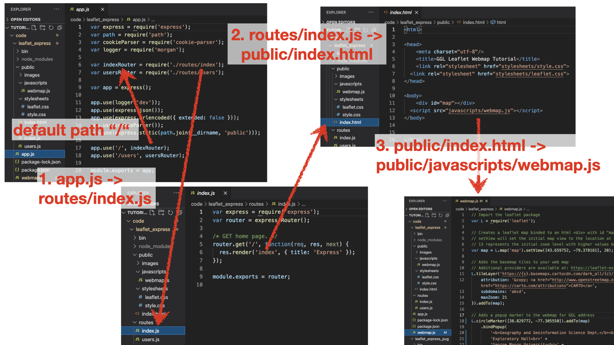
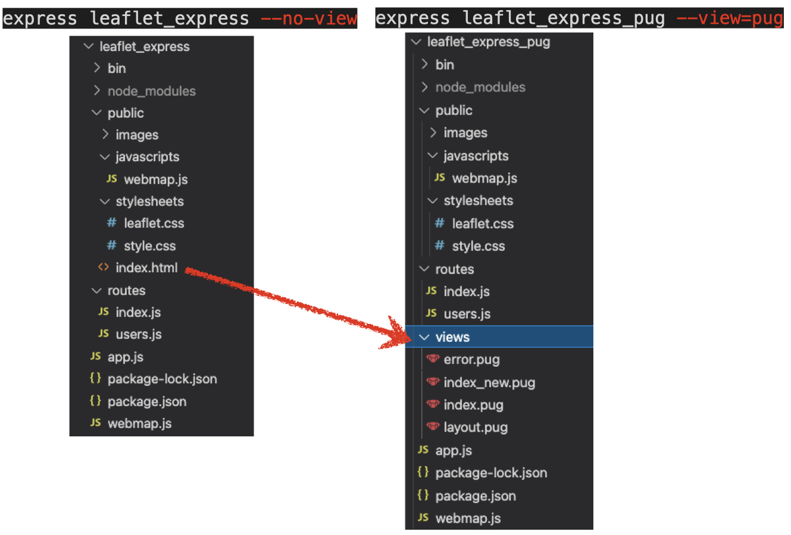

# Tutorial: Express Node.js Server Leaflet Webmap

Original tutorial from Richard Wen <rrwen.dev@gmail.com>. Additions by Dieter Pfoser <dpfoser@gmu.edu>.
  
A tutorial for creating three leaflet webmaps with express in Node.js. The applications (see code folder) range from a simple webmap (Application 1) to building a client-server application that shows GeoJSON data (Application 3). Application 2 uses [Pug](https://github.com/pugjs/pug) (formely known as jade), a template engine for building Web pages, to implement Application 1. 

# Preliminaries

## Step 1. Install Software

1. Install [Node.js](https://nodejs.org/)
2. Install [express-generator](https://www.npmjs.com/package/express-generator) globally `-g` with [npm](https://docs.npmjs.com/cli/install)
3. Check that the `express` command works by using the `-h` help option

```
npm install -g express-generator
express -h
```

## Step 2. Create an express Project

Using the installed software, we can then create an express project folder with the `express` command. This folder will contain all the code required to serve our web pages as Hyper Text Markup Lanauge (HTML)[https://www.w3schools.com/html/] files.

### 2.1 Open a Command Line Interface (CLI)

Open a [command line interface](https://en.wikipedia.org/wiki/Command-line_interface) or terminal:


### 2.2 Express Command

Create an express project with the `express` command, replacing `<project_name>` with the name of your project:

* `<project_name>` should be a valid folder name with no spaces and starting with a letter

```
express <project_name> --no-view
```

### 2.3 Inspect the Project Folder Structure

A folder named `<project_name>` will be created with the following structure inside (note that the structure may change with `express --version` that is not 4.16.0):


* `app.js`: JavaScript file that contains code needed to create and run your express server or application
* `package.json`: [JSON](https://www.json.org/) structured [package file](https://docs.npmjs.com/files/package.json) holding all the dependencies and information about your project (can be modified with the [npm](https://docs.npmjs.com/cli/npm) command)
* `/bin`: folder containing executable code
	* `www`: executable file for starting the server
* `/public`: folder containing files served to the client side or front end
	* `index.html`: landing page served to the clients
	* `/images`: folder containing images to be served to clients
	* `/javascripts`: folder containing [JavaScript](https://www.w3schools.com/js/) code files to be served to clients
	* `/stylesheets`: folder containing [Cascading Style Sheets (CSS)](https://www.w3schools.com/css/) files to be served to clients
		* `style.css`: CSS file used to define how your web page elements will look
* `/routes`: folder containing JavaScript files for defining [routes](https://expressjs.com/en/guide/routing.html) that direct how the server responds to client requests (these files are often used in file `app.js`)
	* `index.js`: defines the response to client requests at `<address>/` depending on how it is used in file `app.js`
	* `users.js`: defines the response to client requests at `<address>/users` depending on how it is used in file `app.js`

## Step 3. Install express Dependencies

After generating our project folder, we need to install the required Node.js package dependencies for express.

### 3.1 Change Directory

Move into the project folder, where `<project_name>` is the name of the folder you created in [Step 2.2](#step-22-generate-a-project-folder-with-the-express-command):

```
cd <project_name>
```

### 3.2 Install Package Dependencies

Inside your `<project_name>` folder, install the dependencies with `npm`, where a folder called `/node_modules` will contain the code files of the installed dependencies:

```
npm install
```

# Applications 1: a simple Leaflet Webapp

## Step 4. Creating the leaflet Webmap Code

We can then create a JavaScript file that stores the code for our leaflet web map. Keep in mind that this code requires Node.js which is only available inside the server or back end.

### 4.1 Install leaflet as a Dependency

Install [leaflet](https://www.npmjs.com/package/leaflet) with `npm install` and save it as a dependency `--save` to `package.json`:

```
npm install --save leaflet
```

### 4.2 Create a leaflet JavaScript File

Create a file for the leaflet map by using the `touch` command:

```
touch webmap.js
```

### 4.3 Add leaflet Code to the File

Open `webmap.js` for editing and add the following JavaScript code:

```javascript
// Import the leaflet package
var L = require('leaflet');

// Creates a leaflet map binded to an html <div> with id "map"
// setView will set the initial map view to the location at coordinates
// 13 represents the initial zoom level with higher values being more zoomed in
var map = L.map('map').setView([43.659752, -79.378161], 20);

// Adds the basemap tiles to your web map
// Additional providers are available at: https://leaflet-extras.github.io/leaflet-providers/preview/
L.tileLayer('https://{s}.basemaps.cartocdn.com/dark_all/{z}/{x}/{y}{r}.png', {
	attribution: '&copy; <a href="http://www.openstreetmap.org/copyright">OpenStreetMap</a> &copy; <a href="https://carto.com/attributions">CARTO</a>',
	subdomains: 'abcd',
	maxZoom: 21
}).addTo(map);

// Adds a popup marker to the webmap for GGL address
L.circleMarker([38.829772, -77.305550]).addTo(map)
	.bindPopup(
		'<b>Geography and Geoinformation Science Dept.</b><br>' +
		'Exploratory Hall<br>' + 
		'George Mason University<br>' +
		'Fairfax, VA'
	)
	.openPopup();
```

Save the added [webmap.js](code/leaflet_express/webmap.js) file (links to the actual file in our repository).

### 4.4 Create a HTML Divider for the leaflet Webmap

Notice that in the code of [Section 4.3](#43-add-leaflet-code-to-the-file), a divider `<div>` with the id `map` is required to create the leaflet webmap. 
  
Open `public/index.html` for editing and replace everything with the following HTML code:

* Notice that we added a divider with id `map` to create our leaflet webmap in.
* Note that the width and height of the divider must be set for the webmap to show (we will do this later in a [CSS file](code/leaflet_express/public/stylesheets/style.css)).

```html
<html>

<head>
	<meta charset="utf-8"/>
	<title>GGL Leaflet Webmap Tutorial</title>
	<link rel="stylesheet" href="stylesheets/style.css">
</head>

<body>
	<div id="map"></div>
</body>


</html>
```

Save the modified [public/index.html](code/leaflet_express/public/index.html) file.

## Step 5. Building the leaflet Webmap Code for the Client Side

Since `webmap.js` is not served to the client side and requires the server's backend software to run, it needs to be built into client side code and stored inside the `public` folder in order to display in the browser.

### 5.1 Install browserify

Install [browserify](https://www.npmjs.com/package/browserify) globally `-g` with `npm install`:

```
npm install -g browserify
```

### 5.2 Bundling the leaflet Code

After installing browserify, we can build and bundle the leaflet code from `webmap.js` into `public/javascripts/webmap.js` with the `browserify` command:

```
browserify webmap.js -o public/javascripts/webmap.js
```

For convenience, we can add the browserify bundling command under `scripts: build` in the file [package.json](code/leaflet_express/package.json) (saving after you add this code):

```json
{
  "name": "leaflet",
  "version": "0.0.0",
  "private": true,
  "scripts": {
    "start": "node ./bin/www",
    "build": "browserify webmap.js -o public/javascripts/webmap.js"
  },
  "dependencies": {
    "cookie-parser": "~1.4.4",
    "debug": "~2.6.9",
    "express": "~4.16.1",
    "leaflet": "^1.7.1",
    "morgan": "~1.9.1"
  }
}

```

This allows us to run the same command for bundling the leaflet code with a more convenient call everytime we make changes to `webmap.js`:

```
npm run build
```

### 5.3 Adding the Bundled leaflet Code

You will now notice that [public/javascripts/webmap.js](code/leaflet_express/public/javascripts/webmap.js) exists. This is the bundled version of your leaflet webmap source code, and will need to be added to the [public/index.html](code/leaflet_express/public/index.html) file in order to display your webmap. 

If you open the [public/javascripts/webmap.js](code/leaflet_express/public/javascripts/webmap.js) file, you will notice that it not only contains the [webmap.js](code/leaflet_express/webmap.js) code from above, but all other javascript libraries that are needed to run the code clientside, e.g., leaflet.js. The beauty of this approach is that you won't need any external links to sites hosting javascript libraries in your code, e.g., 
```javascript 
<script src="https://unpkg.com/leaflet@1.7.1/dist/leaflet.js"></script>
```
, but only have to include [webmap.js](code/leaflet_express/public/javascripts/webmap.js), i.e.,
```javascript 
<script src="javascripts/webmap.js"></script>
```
, which has them all bundled!

In this context, think about the elegant interplay of (i) `npm install`, (ii) require statements to include javascript libraries in node.js and (iii) a bundler such as browersify that grabs and bundles them all in a single library file, i.e., in our case [public/javascripts/webmap.js](code/leaflet_express/public/javascripts/webmap.js)

As such, replace the `public/index.html` code with the following:

```html
<html>

<head>
	<meta charset="utf-8"/>
	<title>GGL Leaflet Webmap Tutorial</title>
	<link rel="stylesheet" href="/stylesheets/style.css">
</head>

<body>
	<div id="map"></div>
	<script src="javascripts/webmap.js"></script>
</body>

</html>
```

Save the modified [public/index.html](code/leaflet_express/public/index.html) file.

## Step 6. Final Touches

A set of final touches need to be made for better web map appearance and for the leaflet code to display the map properly.

### 6.1 Adding the leaflet CSS

Leaflet requires a CSS file in [node_modules/leaflet/dist/leaflet.css](code/leaflet_express/node_modules/leaflet/dist/leaflet.css), which can be copied into the public folder that is served to the client:

```
cp node_modules/leaflet/dist/leaflet.css public/stylesheets/leaflet.css
```

You will have to also open [public/index.html](code/leaflet_express/public/index.html) and edit/save it to include the [stylesheets/leaflet.css](code/leaflet_express/public/stylesheets/leaflet.css) file:

```html
<html>

<head>
	<meta charset="utf-8"/>
	<title>GGL Leaflet Webmap Tutorial</title>
	<link rel="stylesheet" href="stylesheets/style.css">
	<link rel="stylesheet" href="stylesheets/leaflet.css">
</head>

<body>
	<div id="map"></div>
	<script src="javascripts/webmap.js" charset="utf-8"></script>
</body>


</html>
```

It is also important to include the CSS file into your build script in [package.json](code/leaflet_express/package.json) so that it is updated everytime you rebuild `webmap.js` with `npm run build`:

```json
{
  "name": "project-name",
  "version": "0.0.0",
  "private": true,
  "scripts": {
    "start": "node ./bin/www",
	"build": "browserify webmap.js -o public/javascripts/webmap.js & cp node_modules/leaflet/dist/leaflet.css public/stylesheets/leaflet.css"
  },
  "dependencies": {
    "cookie-parser": "~1.4.3",
    "debug": "~2.6.9",
    "express": "~4.16.0",
    "leaflet": "^1.4.0",
    "morgan": "~1.9.0"
  }
}
```

### 6.2 Improving the CSS

Since leaflet requires that the dimensions be specified for the webmap divider, we can can replace the contents of the [public/stylesheets/style.css](code/leaflet_express/public/stylesheets/style.css) file with the following to define the width and height of the webmap:

```css
body {
	padding: 0;
	margin: 0;
}
html, body, #map {
	height: 100%;
	width: 100%;
}
```

Save the modified [public/stylesheets/style.css](code/leaflet_express/public/stylesheets/style.css) file.

## Step 7. Running the Server

### 7.1 Final Project Structure

After going through steps 1 to 6, you should have a file structure that looks similar to the following (node_modules not shown):


The following figure provides an overview of the code structure and connections between the various files. 
* When requesting the application's Web page [localhost:3000/](http://localhost:3000/), [app.js](code/leaflet_express_pug/app.js) is executed by the Web server. 
* In [app.js](code/leaflet_express_pug/app.js) the `/` path is linked to the `indexRouter` variable and as such to the [routes/index.js](code/leaflet_express/routes/index.js) file. 
* [routes/index.js](code/leaflet_express/routes/index.js) renders the [public/index.html](code/leaflet_express/public/index.html) file for the `/` path.
* [public/index.html](code/leaflet_express/public/index.html) includes [public/webmap.js](code/leaflet_express/public/javascripts/webmap.js). Remember that this is the bundled javascript library that contains your [webmap.js](code/leaflet_express/webmap.js) file and all libraries that are mentioned as dependencies in [package.json](code/leaflet_express/package.json).



### 7.2 Run the express Server

Run the express server with the following command:

```
npm start
```

### 7.3 Viewing the Client Side Browser

By default, express runs on port `3000` on `localhost`, which can be accessed in the browser by going to:  
  
[http://localhost:3000/](http://localhost:3000/)  
  
Your browser should display a map that looks similar to the one below:


### 7.4 Shutting Down the express Server

When you are done running the server, shut it down by pressing `Ctrl + C` and then answering `yes` to the user prompt asking for termination.

## Automating Tasks

# VSCode

The tutorial so far has focussed on running the environment using a command line interface. Luckily, there are more comfortable developer environments such as [VSCode](https://code.visualstudio.com). VSCode not only helps you with keeping your code organized, but also provides code analysis such as highlighting (linting), running and debugging, and integrates well with github. 

# Application 2: PUG/Jade Templating

[Section 2.2](#22-express-command) shows how to create an express project folder structure using the following command.

```
express <project_name> --no-view
```

This creates the following structure

.

This first express application uses basic html to embed Javascript. Application 2 now uses Pug, which is a template engine for Node to write html. It uses a simplified syntax that compiles to HTML. It makes for  more reusable and readable code. Check out this nice [Pug overview and tutorial](https://www.sitepoint.com/a-beginners-guide-to-pug/). 

A simple modification to the above express statement creates project that uses Pug templating instead of simple html.

```
express <project_name> --view=pug
```
The resulting folder structure in comparison to Application 1 now looks as follows.

.

## Pug templates
Using a templating engine, the index.html page is replaced by Pug views. Our example uses two views layout.
[layout.pug](code/leaflet_express_pug/views/layout.pug) provides the basic web page template including all stylesheet javascript library links. 

```jade
// layout.pug
doctype html
html
  head
    title= title
    link(rel='stylesheet', href='/stylesheets/style.css')
    link(rel='stylesheet', href='/stylesheets/leaflet.css')
  body
    block content
```
This template is used as a basis for actual web pages such as [index.pug](code/leaflet_express_pug/views/index.pug), which `extends layout`. [index.pug](code/leaflet_express_pug/views/index.pug) defines one `div` element for our Leaflet map object and also includes our Javascript code used to create the Leaflet web map (remember, browserify is used to package all libraries that we `require` in our code.)

```pug
// index.pug
extends layout

block content
  // create a <div> map element to be referenced in webmap.js
  #map
  // the leaflet javascript code...
  script(src='/javascripts/webmap.js') 

```

And that is it! In a nutshell, this example replaces [index.html](code/leaflet_express/public/index.html) with [layout.pug](code/leaflet_express_pug/views/layout.pug) and [index.pug](code/leaflet_express_pug/views/index.pug), two Pug views (html template files).

The commands to **build your code**, i.e., copy all relevant files to the public directory, and to **start the application** remain the same, and the web application will be available [localhost:3000](http://localhost:3000/).
```
npm run build
npm start
```

# Application 3: Leaflet and Data
Building on Application 2, we want to expand its scope but showing markers created from a GeoJSON dataset.

